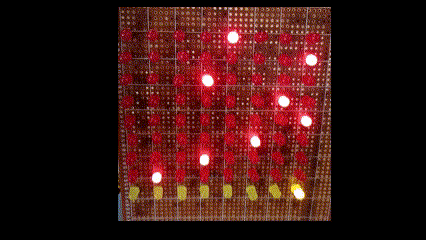
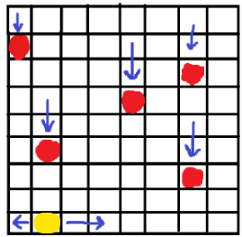
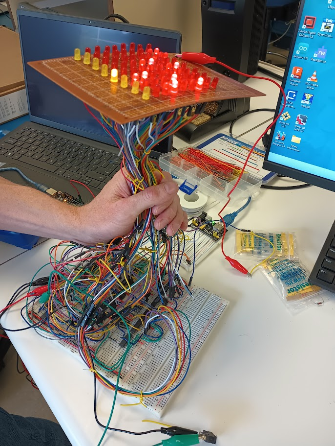

# Deadline Dodge

Deadline Dodge, an old school 8x9 LED matrix game made only with logic gates and other [7400-series ICs](https://en.wikipedia.org/wiki/List_of_7400-series_integrated_circuits)

By [Hurley1340](https://github.com/Hurley1340) and [SnkSynthesis](https://github.com/SnkSynthesis)

See [Gallery](#gallery).

## Concept

We wanted a fun visuak final project for our digital logic design class. However we had some constraints:
* only allowed to use [7400-series ICs](https://en.wikipedia.org/wiki/List_of_7400-series_integrated_circuits) for logic
* A deadline for project completion (hence the name _deadline_-dodge)

With those 2 things in consideration, we came up with the following concept: 

* An 8x9 LED matrix
* Rocks psuedorandomly spawn in one of the 8 columns
(denoted by illuminated red LEDs)
* The player has to dodge these rocks by moving left, right, or standing still (via left and right buttons)
* A collision between the player and one of the rocks will end the game (which clear the screen)
* The game speeds up over time
* Player position can be reset to starting position by pressing LOAD button

## Implementation
* Uses only [7400-series ICs](https://en.wikipedia.org/wiki/List_of_7400-series_integrated_circuits) for logic.
* We designed and simulated our circuitry using Multisim (`.ms14` files can be found in the folders of this repository)
* Most of the circuitry was made on breadboards
* The LED matrix was soldered on a perfboard and connected to the breadboard circuit via jumper wires.

## Overall Schematic (block-level)

## Outline
To understand the individual logic blocks mentioned in the game, we suggest recommend viewing the following folders in order:
1. [lfsr-decoder-logic](./lfsr-decoder-logic) - Psuedorandomly selects a column to spawn a rock in (rock will descend each clock cycle) 
2. [speed-logic](./speed-logic) - Decides how fast rocks spawn and fall
3. [player-movement-logic](./player-movement-logic) - Translates input given by player into movement
4. [collision-logic](./collision-logic) - Detects whether there is a collision between the player and a rock

## Gallery

View demonstration video

 
  
**NOTE**: 2 of the 8 columns are not connected due to time constraints we had while filming but those 2 columns are operational

[Demonstration Video](https://drive.google.com/file/d/1kh-cmQssLxfHI6EVnNEhwa_JeeISMlLd/view?usp=sharing)

View holding circuit image

