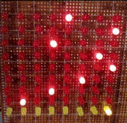

# deadline-dodge

Deadline Dodge, an old school 8x9 LED matrix game made only with logic gates and other 74-series components

By [Hurley1340](https://github.com/Hurley1340) and [SnkSynthesis](https://github.com/SnkSynthesis)

## Concept

* An 8x9 LED matrix
* Rocks psuedorandomly spawn in one of the 8 columns
(denoted by illuminated red LEDs)
* The player has to dodge these rocks by moving left, right, or standing still (via left and right buttons)
* A collision between the player and one of the rocks will end the game (which clear the screen)
* The game speeds up over time
* Player position can be reset to starting position by pressing LOAD button
* Uses only [7400-series ICs](https://en.wikipedia.org/wiki/List_of_7400-series_integrated_circuits) for logic.

## Overall Schematic

