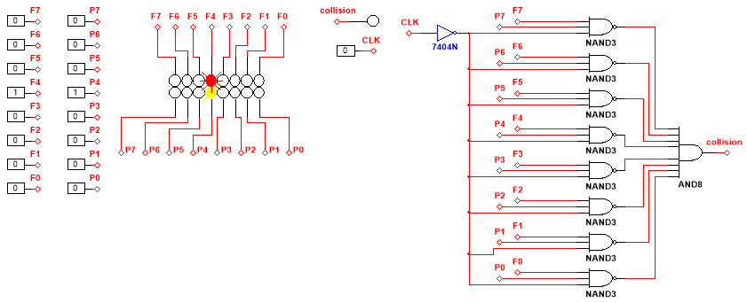

# Collision Logic

This logic decides whether there is a collision between the player and a rock. In the case of a collision, an active-low signal is sent to clear the columns shift registers. The logic is a nandized SOP (that has been inverted for active-low output).

If we focus on only one column, then we see the following things have to be true to trigger a collision signal:
* The system clock signal has to be low*
* The player is present in that column
* A rock is present in the bottom-most cell (cell above player)

*The system clock signal has to be low so the player has a chance to see the collision happening otherwise the screen will clear too quickly for the player to realize a collision happened.

_Screenshot of collision_logic.ms14_
