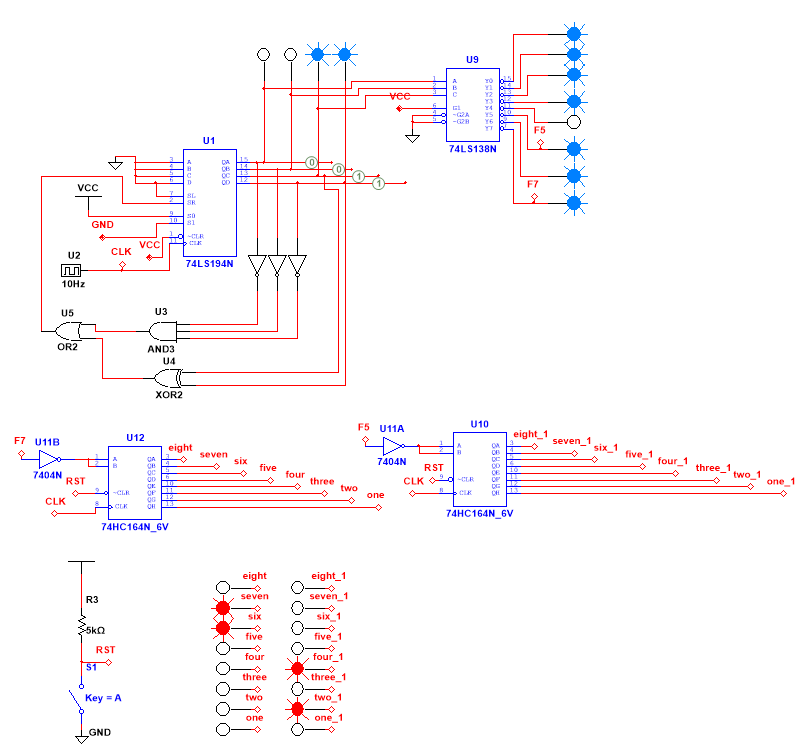
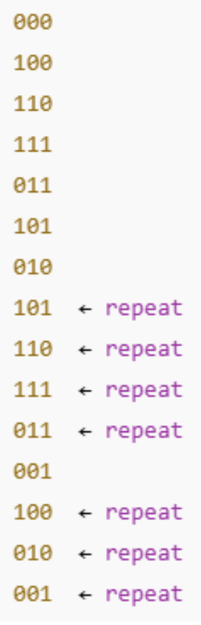

# LFSR + decoder logic
This is the logic that decides which column to spawn rocks in.

The schematic shows an LFSR (linear feedback shift register) being decoded by a 3-to-8 decoder. We are using the LFSR as our psuedorandom number generator. 3 of 4 taps are used on the LFSR so the falling rocks have a longer sequence with repitions to seem more random (see below). The decoder "chooses" a column (shift register) to send a rock down on each clock cycle. The image shows 2 of 8 shift registers, column F5 and column F7 (for demonstration purposes). The image demonstrates an example of the overall function and logic of the falling rocks - not the full game.

The decoded sequence is as follows:

 
