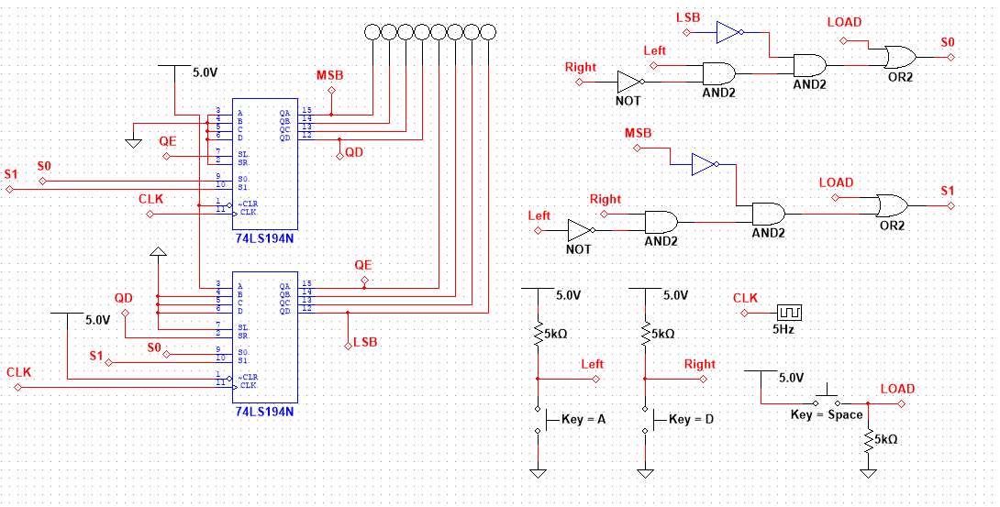

# Player Movement Logic

This is the logic that takes input from the user and manipulates the position
of the player. There are 3 buttons that the user can press:

* LOAD button  - resets the position of the player
* Right button - moves player to the right
* Left button  - moves player to the left

