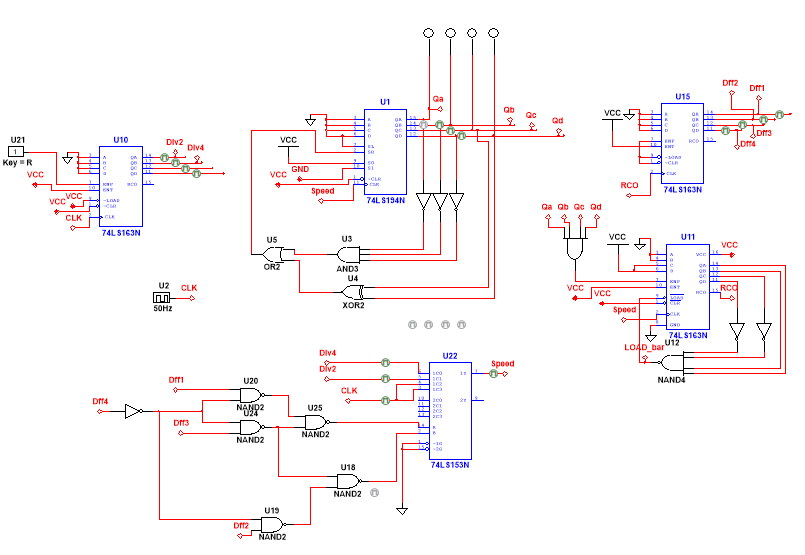

# Speed Logic

This circuitry controls the speed of the [lfsr-decoder-logic](../lfsr-decoder-logic/) and, in turn, how fast the rocks fall in the game. It is a modular feature that introduces three distinct speed levels.

When the player survives for a set amount of time without triggering any collision (i.e., without losing), the speed logic increases the speed at which rocks spawn and fall and making the game progressively harder.

## Operation

### Triggering the Speed Increase
An AND gate detects the LFSR state 1111 (inputs: Qa, Qb, Qc, Qd), which occurs at regular intervals. This output increments a mod-6 counter (74LS163N). Although the counter is designed to count up to 6, it is forced to jump directly to its maximum count (1111). This sets the RCO pin high, triggering the next stage.

### Speed Level Control
The next stage is another 74LS163N counter. Each time this counter is incremented, the game speed increases. After two speed increases, the counter locks at its highest setting so the final speed is maintained for the rest of the game.

### Speed Selection and Distribution
The counter’s outputs are decoded with combinational logic to control a 74LS153 4-to-1 multiplexer (MUX).

The MUX selects between three clock inputs:
* System clock (full speed)
* Divide-by-2 clock (medium speed)
* Divide-by-4 clock (low speed)
The two divided clocks are generated by using a counter as a frequency divider (divides by factor of 2 for each output bit).

The MUX output determines the active game speed. This clock signal is fed back into the rest of the game except for the [player-movement-logic](../player-movement-logic] and [collision-logic](../collision-logic) (system clock is needed for optimal responsiveness), so that all elements operate in sync with the selected tempo.

## Schematic

